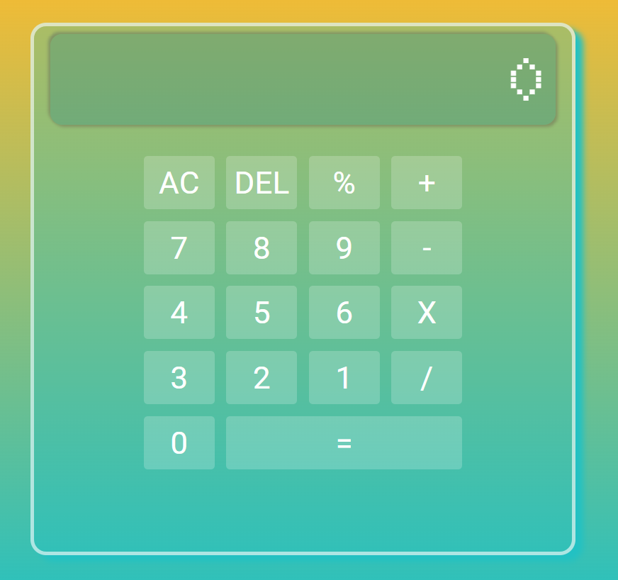

# Simple Calculator

A simple calculator project built using HTML, CSS, and JavaScript.

## Features

- Basic arithmetic operations: addition, subtraction, multiplication, and division
- Responsive design
- Clear and intuitive user interface

## Demo

You can try out the live demo [here](https://raw.githack.com/Cooki3GOD/simpleCalculator/main/index.html).

## Screenshot



## Installation

To run this project locally, follow these steps:

1. Clone the repository:
    ```sh
    git clone https://github.com/Cooki3GOD/simpleCalculator.git
    ```
2. Navigate to the project directory:
    ```sh
    cd simpleCalculator
    ```
3. Open the `index.html` file in your web browser.

## Usage

1. Open the application in your web browser.
2. Use the number buttons and operation buttons to perform calculations.
3. Click the `=` button to see the result.
4. Click the `AC` button to clear the current input.

## Contributing

Contributions are welcome! Please fork this repository and submit a pull request for any improvements or bug fixes.

## Contact

For any questions or feedback, feel free to open an issue or contact me at [asamaelcontact@gmail.com].
